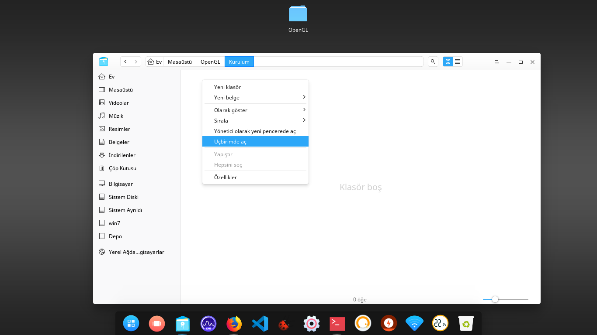
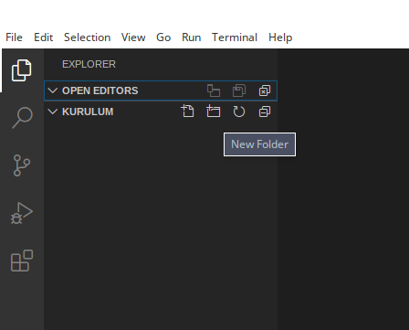
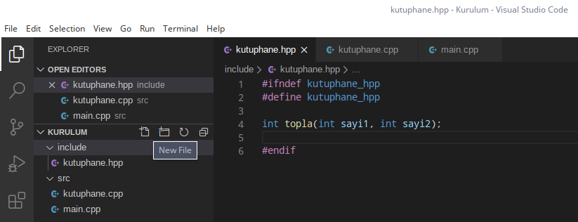
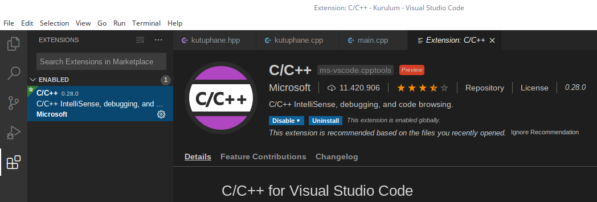
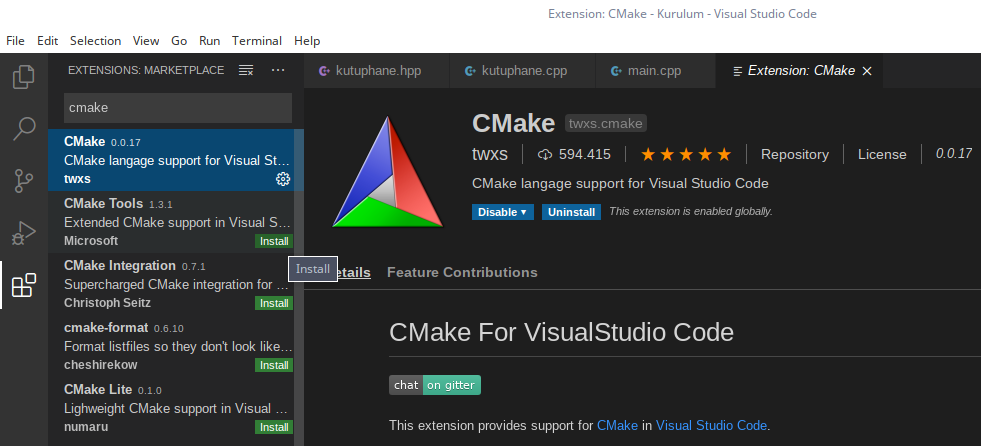

# VS Code OpenGL Kurulumu & Manuel Çalıştırma : 000-Kurulum

>**Not :** VS Code kurulu değilse; [Pardus forumda mevcut olan bu bağlantıya tıklayarak](https://forum.pardus.org.tr), ulaşabilirsiniz.

## Eğitim Başlıkları

Genel eğitim VS Code, Cmake, OpenGL gibi konulara değinmiştir. Detaylı bir başlangıç kurulum eğitimidir.

#### Gerekli Paket Kurulumları

Öncelikle `g++` derleyicisini sisteme kurmamız gerekmektedir.
```git
sudo apt install build-essential
```
Belki sizde kurulu olabilir.Versiyon kontrolü için :
```git
g++ -v
```

Şimdi ise her türlü işletim sistemi ortamında programımızı derleyebilmemiz için **Cmake** 'i kuruyoruz.

```git
sudo apt install cmake
```

Versiyon kontrolünü `cmake --version` koduyla sağlayabiliriz.

Devamında VS Code ortamını Pardus 'umuza veya kullandığınız Linux ortamına kurmanız gerekmektedir. Bununla ilgili yönergeleri Microsoft 'un https://code.visualstudio.com/docs/setup/linux adresinden veya [Pardus Forumda oluşturduğum konudan](forum.pardus.org.tr) Türkçe anlatımına ulaşabilirsiniz.



Ben **Masaüstü** ortamımda **OpenGL --> Kurulum** yolunda klasör yapısı oluşturduktan sonra **Uçbirimde aç** seçeneğiyle konsol ekranının bulunduğum klasörde açılmasını sağlıyorum. Bu ekranda **`code .`** yazarak VS Code 'un klasör ağacını açmasını sağlayabilirsiniz. Aslında yaptığımız işlem **File --> Open Folder** ile aynı mantıktadır. İstediğiniz yolu seçebilirsiniz.

**Welcome(Başlangıç)** ekranını kapatabilirsiniz. Öncelikle gerekli **`C++`** ortamımızı oluşturmakla başlayalım. `New Folder` ile klasörlerimizi ve `New File` seçeneğiyle dosyalarımızı oluşturuyoruz. Kendi oluşturduğumuz kütüphaneleri de dahil edebileceğimiz genel bir yapı oluşturacağız.



`include --> kutuphane.hpp` ve `src --> kutuphane.cpp, main.cpp` şeklinde dosya ağacımızı kuruyoruz. Aşağıdaki gibi bir görüntü elde etmiş olacaksınız.



Başlık dosyasında basit bir prototip oluşturup, `.cpp` dosyasında tanımlıyoruz(function definition).
```c
//Function declaration (deklara etmek, prototip oluşturmak) :
int topla(int sayi1, int sayi2);

//Function definition (tanımlamak) :
int topla(int sayi1, int sayi2){
  return sayi1 + sayi2;
}
```

`kutuphane.hpp` dosyası içeriği :

```c
#ifndef kutuphane_hpp
#define kutuphane_hpp

int topla(int sayi1, int sayi2);

#endif
```

`kutuphane.cpp` dosyası içeriği :

```c
#include "kutuphane.hpp"

int topla(int sayi1, int sayi2){
    return sayi1 + sayi2;
}
```


`main.cpp` dosyası içeriği : (**Not :** Son hali değildir. Aşama aşama anlatılmak istenmiştir.)

```c
#include <iostream>

#include "kutuphane.hpp"

int main(int argc, char** argv){

    std::cout << topla(10,20) << std::endl;


    std::cin.get();
}
```

**VS Code** bir metin editörüdür. IDE gibi davranması için çeşitli eklentileri kurmamız gerekiyor. En başka [Pardus Forumda oluşturduğum konudan](forum.pardus.org.tr) Türkçe VS Code **`C/C++`** eklentisini baştan kurmuş olmalıydınız. Soldaki eklentiler menüsünden `Extensions` veya <kbd>Ctrl</kbd> + <kbd>Shift</kbd> + <kbd>X</kbd> kısayoluyla açabilirsiniz.



Tabi; **`Cmake`** diye aratıp, Cmake eklentilerini de kurmalıyız. Ayrıca; yine Microsoft 'un geliştirmeyi devraldığı `Cmake Tools` eklentisini de kurmalısınız. Kurulum bittiğinde otomatik olarak yapılandırma seçeneği çıkmaktadır. Dilerseniz bu kısayol yöntemiyle yapılandırabilirsiniz. Biz şimdilik uzun yolu tercih edip, mantığını anlamaya çalışacağız.



**Cmake,** projemizi istediğimiz platformda derlenebilecek hale getirmeye yarayan bir araçtır. Bunu yapabilmesi için projemizde kullandığımız dosyaları ona tanıtmamız gerekiyor. Yani; bazı bilgilere sahip olması gerekiyor.

