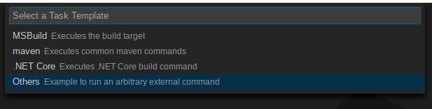
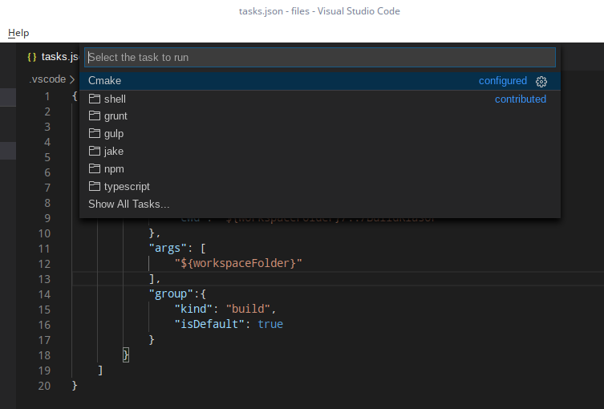
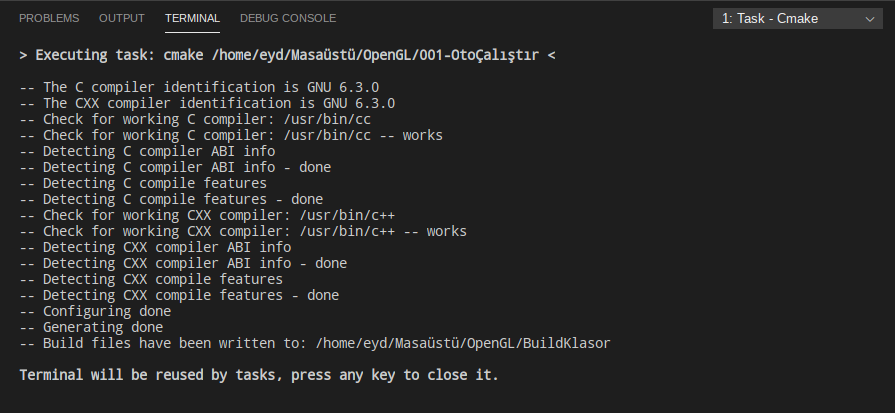
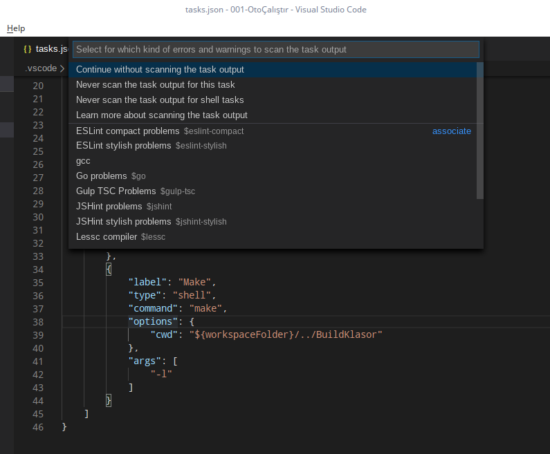
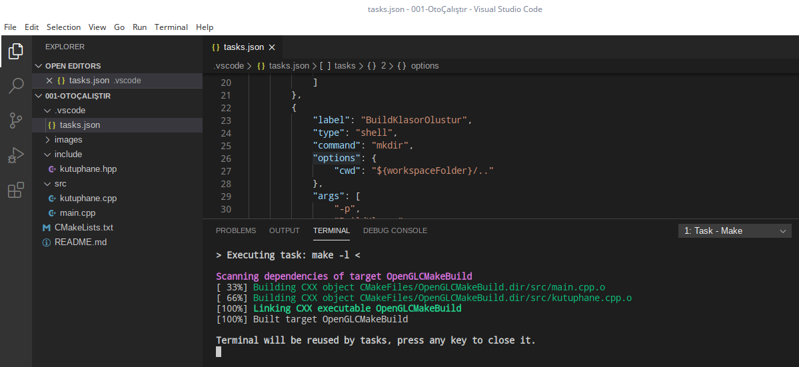
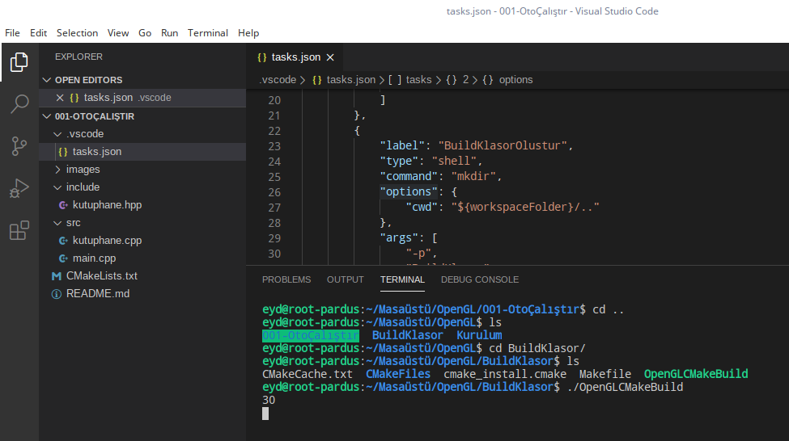
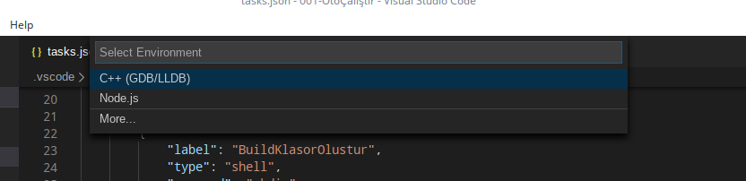
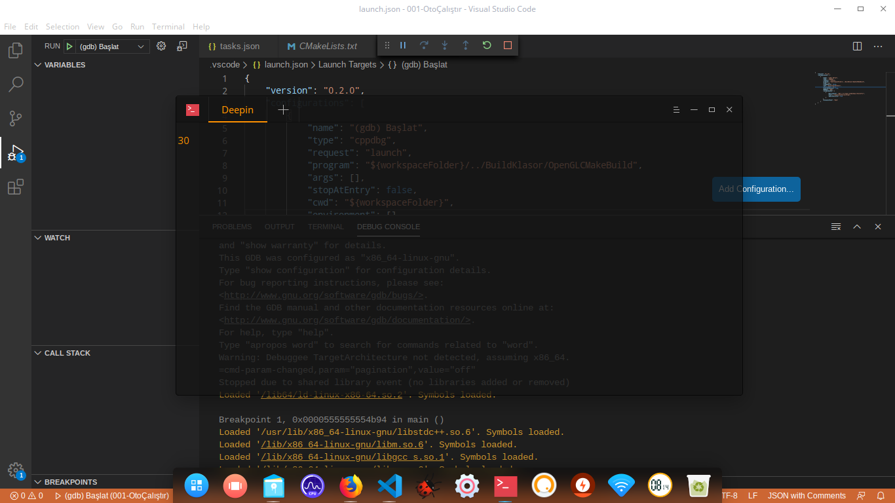

# VS Code Cmake Yapılandırma & Otomatik Çalıştırma

Bu bölümde ilk bölümün devamı olarak VS Code da Cmake yapılandırma ayarlarını göreceğiz. Bu şekilde VS Code ortamımızı artık **konsol(terminal)** ekranında tek tek kod yazıp, derlemek yerine bir kaç tıklamayla da tüm işi yapabilir hale getireceğiz.
>**Not :** VS Code kurulu değilse; [Pardus forumda mevcut olan bu bağlantıya tıklayarak](https://forum.pardus.org.tr), ulaşabilirsiniz.

## Eğitim İçeriği

Eğitimimizde VS Code ile bağlantı kurmamızı ve yapılandırmamızı sağlayan **`.json`** dosyalarını ele alacağız.

---

## Configure Tasks (Görev Oluşturma ve Yapılandırma)

**Cmake** otomatik çalıştırılması için VS Code Tasks sistemini kullanacağız. Bunun için; **VS Code** üst menüsünde **`Terminal --> Configure Tasks...`** seçeneğini seçtikten sonra, **`Create tasks.json file from template`** ile devam ediyoruz. Karşımıza çıkan ekranda **`Other ...`** ile başlayan seçeneği seçiyoruz.



Muhtemelen karşınıza aşağıdaki kodlar gelecektir. Detaylı bir şekilde bilgi almak için belirtilen Microsoft 'un kaynağına gidebilirsiniz.

```json

{
    // See https://go.microsoft.com/fwlink/?LinkId=733558
    // for the documentation about the tasks.json format
    "version": "2.0.0",
    "tasks": [
        {
            "label": "echo",
            "type": "shell",
            "command": "echo Hello"
        }
    ]
}

```

Şimdi dosyamızı aşağıdaki gibi değiştirelim.

```json

{
    "version": "2.0.0",
    "tasks": [
        {
            "label": "Cmake",
            "type": "shell",
            "command": "cmake",
            "options": {
                "cwd": "${workspaceFolder}/../BuildKlasor"
            },
            "args": [ 
                "${workspaceFolder}"
            ],
            "group":{
                "kind": "build",
                "isDefault": true
            }
        }
    ]
}

```

Böylelikle ilk görevimizi eklemiş olduk. **`Terminal --> Run Task...`** seçeneğini seçtiğimizde task menüsünde **`CMake`** isimli oluşturduğumuz taskı görebiliyoruz. **Build** türünde bir task olduğu için <kbd>Ctrl</kbd> + <kbd>Shift</kbd> + <kbd>B</kbd> ile de **`Terminal --> Run Build Task...`** görevini kısayoldan çalıştırmış oluruz.
>**Not :** `"cwd": değişkenine çıktıyı çalıştığımız klasörün üstündeki klasörde "BuildKlasor" şeklinde yol belirttik. Şu anki haliyle bu klasörü siz oluşturmazsanız hata alırsınız. Bunu da şimdi geliştirerek, bu hatayı gidermekden bahsedeceğiz.





Öncelikle **Cmake** taskımıza ön tanımlı olacak şekilde task tanımlıyoruz. Bu önce bu taskı çalıştır, bittikten sonra Cmake 'i çalıştır anlamına geliyor. Bunun için Cmake dizisi içerisindeki son tanımdan sonra **,(virgül)** koyup, **"dependsOn":** değişkenini ekliyoruz. Ön tanımlı oluşturulacak taskın ismini belirtiyoruz.

```json

"dependsOn":[
                "BuildKlasorOlustur"
]

```

Harika! Sıra taskımızı eklemeye geldi. "tasks": dizisi içerisinde **Cmake** taskından sonrada ,(virgül) ile ayırıp, süslü parantezler açıp, içerisine yeni taskımızı tanımlamaya başlıyoruz.

```json

{
"label": "BuildKlasorOlustur"
...
...
}

```

type, command gibi değerleri tanımladıktan sonra yeni taskımızla birlikte **tasks.json** dosyamızın son hali şu şekilde olmalıdır.

```json

{
    "version": "2.0.0",
    "tasks": [
        {
            "label": "Cmake",
            "type": "shell",
            "command": "cmake",
            "options": {
                "cwd": "${workspaceFolder}/../BuildKlasor"
            },
            "args": [ 
                "${workspaceFolder}"
            ],
            "group":{
                "kind": "build",
                "isDefault": true
            },
            "dependsOn":[
                "BuildKlasorOlustur"
            ]
        },
        {
            "label": "BuildKlasorOlustur",
            "type": "shell",
            "command": "mkdir",
            "options": {
                "cwd": "${workspaceFolder}/.."
            },
            "args": [
                "-p", 
                "BuildKlasor"
            ]
        }
    ]
}

```

Dikkat edilmesi gereken husus, `"args":` değişkenine `"-p"` değerini vermeseydik, ilk çalışmada sorun olmasa da ikinci ve diğer çalışmalarımızda **mkdir** komutu hata döndürecekti. Çünkü; "BuildKlasor" isimli dizini bir kere oluşturduktan sonra üstüne yazmaz. O nedenle hata alırız ve Cmake taskımızda ön tanımlı task çalışmadığından dolayı herhangi bir işlem gerçekleşmez. İşte bunu engellemek için `"-p"` parametresini kullanıyoruz.

Şimdi Cmake ile oluşturulan `Makefile` dosyasını derleyecek **`make`** taskını ekliyoruz.

```json

{
       "label": "Make",
       "type": "shell",
       "command": "make",
       "options": {
              "cwd": "${workspaceFolder}/../BuildKlasor"
       },
       "args": [
              "-l"
       ]
}
        
```

**`Terminal --> Run Task...`** ile **Make** seçeneğini seçerek ilerlediğimizde herhangi bir sorunla karşılaşmazdan derleme işlemini gerçekleştiriyoruz.






Şimdi ilgili klasöre gidip, dosyamızı çalıştırıyoruz.



Programımız çalıştığına göre şimdi de **`Run --> Start Debugging`** ile **Debug** ayarlarını seçebiliriz.



Görüldüğü gibi gizli olan **.vscode** klasörümüze birde **launch.json** konfigürasyon dosyası eklendi. Ayrıca; **`"preLaunchTask": "Make"`** eklersek, Debug işleminden önce otomatik olarak **Make** taskını işleme koyar. Eğer bu seçeneği eklemezsek, Debug 'dan önce mutlaka Make Build 'ini elle çalıştırmalıyız. Build Task içinse sadece Cmake dosyasında değişiklik yaptığımızda ve en başta Make dosyasını oluşturmak için bir kere çalıştırmamız yeterlidir. 

```json

{
    "version": "0.2.0",
    "configurations": [
        {
            "name": "(gdb) Başlat",
            "type": "cppdbg",
            "request": "launch",
            "program": "${workspaceFolder}/../BuildKlasor/OpenGLCMakeBuild",
            "args": [],
            "stopAtEntry": false,
            "cwd": "${workspaceFolder}",
            "environment": [],
            "externalConsole": true,
            "MIMode": "gdb",
            "setupCommands": [
                {
                    "description": "gdb için düzgün yazdırmayı etkinleştir",
                    "text": "-enable-pretty-printing",
                    "ignoreFailures": true
                }
            ],
            "preLaunchTask": "Make"
        }
    ]
}

```

Şimdi <kbd>F5</kbd> kısayoluyla Debug işlemini başlatalım.



---

**MIT Lisansı**

[Telif Hakkı](https://github.com/w3eydi/OpenGL-VSCode/blob/master/LICENSE) (Copyright) (c) 2020 Eydi Gözeneli - github.com/w3eydi
