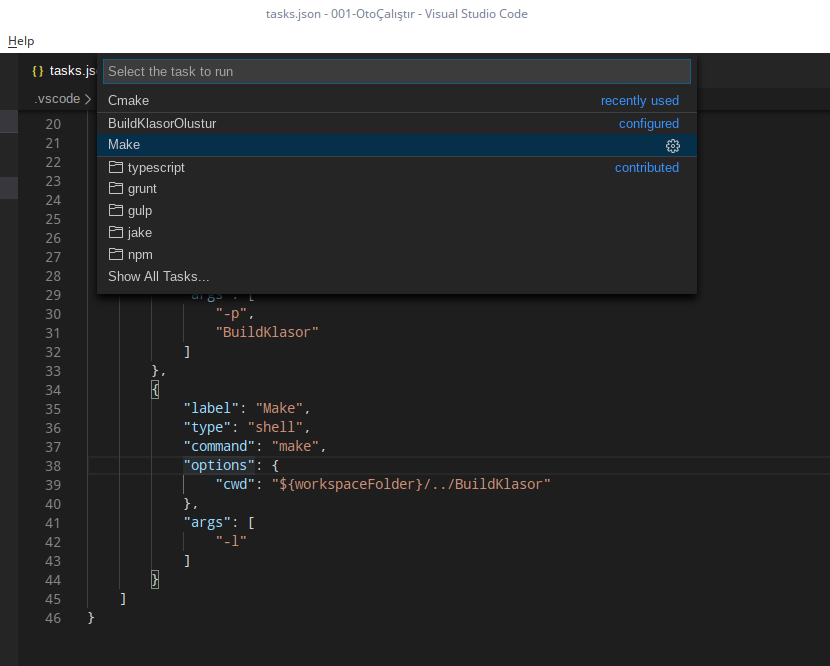

# VS Code Cmake Yapılandırma & Otomatik Çalıştırma

Bu bölümde ilk bölümün devamı olarak VS Code da Cmake yapılandırma ayarlarını göreceğiz. Bu şekilde VS Code ortamımızı artık **konsol(terminal)** ekranında tek tek kod yazıp, derlemek yerine bir kaç tıklamayla da tüm işi yapabilir hale getireceğiz.
>**Not :** VS Code kurulu değilse; [Pardus forumda mevcut olan bu bağlantıya tıklayarak](https://forum.pardus.org.tr), ulaşabilirsiniz.

## Eğitim İçeriği

Eğitimimizde VS Code ile bağlantı kurmamızı ve yapılandırmamızı sağlayan **`.json`** dosyalarını ele alacağız.

---

## Gerekli Paket Kurulumları Ve Ayarları

Öncelikle projemizde derleme yapabilmemiz için gerekli olan `g++` derleyicisini sisteme kurmamız gerekmektedir.
```git
sudo apt install build-essential
```
Belki sizde kurulu olabilir. Versiyon kontrolü için :
```git
g++ -v
```

Şimdi ise her türlü işletim sistemi ortamında programımızı derleyebilmemiz için **Cmake** 'i kuruyoruz.

```git
sudo apt install cmake
```

Versiyon kontrolünü `cmake --version` koduyla sağlayabiliriz.

Devamında VS Code ortamını Pardus 'umuza veya kullandığınız Linux ortamına kurmanız gerekmektedir. Bununla ilgili yönergeleri Microsoft 'un https://code.visualstudio.com/docs/setup/linux adresinden veya [Pardus Forumda oluşturduğum konudan](forum.pardus.org.tr) Türkçe anlatımına ulaşabilirsiniz.


Ben **Masaüstü** ortamımda **OpenGL --> Kurulum** yolunda klasör yapısı oluşturduktan sonra **Uçbirimde aç** seçeneğiyle konsol ekranının bulunduğum klasörde açılmasını sağlıyorum. Bu ekranda **`code .`** yazarak VS Code 'un klasör ağacını açmasını sağlayabilirsiniz. Aslında yaptığımız işlem **File --> Open Folder** ile aynı mantıktadır. İstediğiniz yolu seçebilirsiniz.

**Welcome(Başlangıç)** ekranını kapatabilirsiniz. Öncelikle gerekli **`C++`** ortamımızı oluşturmakla başlayalım. `New Folder` ile klasörlerimizi ve `New File` seçeneğiyle dosyalarımızı oluşturuyoruz. Kendi oluşturduğumuz kütüphaneleri de dahil edebileceğimiz genel bir yapı oluşturacağız.


`include --> kutuphane.hpp` ve `src --> kutuphane.cpp, main.cpp` şeklinde dosya ağacımızı kuruyoruz. Aşağıdaki gibi bir görüntü elde etmiş olacaksınız.


Başlık dosyasında basit bir prototip oluşturup, `.cpp` dosyasında tanımlıyoruz(function definition).
```c
//Function declaration (deklara etmek, prototip oluşturmak) :
int topla(int sayi1, int sayi2);

//Function definition (tanımlamak) :
int topla(int sayi1, int sayi2){
  return sayi1 + sayi2;
}
```

`kutuphane.hpp` dosyası içeriği :

```c
#ifndef kutuphane_hpp
#define kutuphane_hpp

int topla(int sayi1, int sayi2);

#endif
```

`kutuphane.cpp` dosyası içeriği :

```c
#include "kutuphane.hpp"

int topla(int sayi1, int sayi2){
    return sayi1 + sayi2;
}
```


`main.cpp` dosyası içeriği : (**Not :** Son hali değildir. Aşama aşama anlatılmak istenmiştir.)

```c
#include <iostream>

#include "kutuphane.hpp"

int main(int argc, char** argv){

    std::cout << topla(10,20) << std::endl;


    std::cin.get();
}
```

**VS Code** bir metin editörüdür. IDE gibi davranması için çeşitli eklentileri kurmamız gerekiyor. En başta [Pardus Forumda oluşturduğum konudan](forum.pardus.org.tr) Türkçe VS Code **`C/C++`** eklentisini kurmuş olmalıydınız. Soldaki eklentiler menüsünden `Extensions` veya <kbd>Ctrl</kbd> + <kbd>Shift</kbd> + <kbd>X</kbd> kısayoluyla açabilirsiniz.


Tabi; **`Cmake`** diye aratıp, Cmake eklentilerini de kurmalıyız. Ayrıca; yine Microsoft 'un geliştirmeyi devraldığı **`Cmake Tools`** eklentisini de kurmalısınız. Kurulum bittiğinde otomatik olarak yapılandırma seçeneği çıkmaktadır. Dilerseniz bu kısayol yöntemiyle yapılandırabilirsiniz. Biz şimdilik uzun yolu tercih edip, mantığını anlamaya çalışacağız.


**Cmake,** projemizi istediğimiz platformda derlenebilecek hale getirmeye yarayan bir araçtır. Bunu yapabilmesi için projemizde kullandığımız dosyaları ona tanıtmamız gerekiyor. Yani; bazı bilgilere sahip olması gerekiyor. Hangi dosyaların dahil olduğu, hangi kütüphaneleri projemize dahil edeceğimizi önceden Cmake 'e bildiriyoruz. Bunun için **`CMakeLists.txt`** isimli bir dosyayı ana dizinde oluşturuyoruz.

İlk olarak Cmake versiyonunu belirtiyoruz.

```cmake
cmake_minimum_required(VERSION 2.8)
```

Daha sonra projenin çıktı olarak oluşturulacağı ismi giriyoruz.

```cmake
project(OpenGLCMakeBuild)
```

Şimdi Cmake 'e proje dizin yollarını ve dahil olan dosyaları ekliyoruz. `${CMAKE_SOURCE_DIR}` ile proje yolunu belirtsede, `set()` fonksiyonuyla kendi değişkenimizi oluşturup, `PROJECT_DIR` ismine atıyoruz. Böylece daha temiz ve karmaşıklığa yol açmadan bu değişken ismi üzerinden diğer değişkenlerimizi de oluşturuyoruz.

```cmake
set(PROJECT_DIR ${CMAKE_SOURCE_DIR})

set(PROJECT_INCLUDE_DIR ${PROJECT_DIR}/include)

set(PROJECT_SOURCE_DIR ${PROJECT_DIR}/src)

set(PROJECT_SOURCES
        ${PROJECT_SOURCE_DIR}/main.cpp
        ${PROJECT_SOURCE_DIR}/kutuphane.cpp)

set(PROJECT_HEADERS
        ${PROJECT_INCLUDE_DIR}/kutuphane.hpp)
```

Son olarak projemizdeki kütüphaneleri ve yürütülebilen dosyaları sisteme ekliyoruz. Buradaki `${PROJECT_NAME}` aslında yukarıda `cmake project(OpenGLCMakeBuild)` koduyla oluşturduğumuz proje ismidir.

```cmake
include_directories(${PROJECT_INCLUDE_DIR})

add_executable(${PROJECT_NAME} ${PROJECT_SOURCES})
```

---

## Cmake İle Projeyi Çalıştırma

**VS Code** içerisinden Kurulum dosyasındaki boş alanda fare ile sağ tıklayarak **Open in Terminal** ile yapabileceğimiz gibi ilgili klasörde de **Uçbirimde aç** seçeneğiyle de konsol ekranına ulaşabiliriz. Konsol ekranına ulaştıktan sonra bir sonraki bölümde dış bir klasöre aktaracak olsakda bu ders kapsamında deneme yapmamız için **`build`** isimli bir klasör oluşturuyoruz.

```bash
mkdir build
cd build
```

Şimdi sıra inşa işlemine geldi. Bir üstteki klasördeki `CMakeLists.txt` dosyasını kullanabilmek için konsolda **`cmake ..`** komutunu çalıştırıyoruz. Bu sayede cmake bizim bulunduğumuz klasöre **`make`** komutuyla sistemimize uygun çalışan dosyaları elde edebileceğimiz inşa işlemine başlayacaktır.


Bulunduğumuz `build` klasörünü **`ls`** komutuyla kontrol ettiğimizde derleme yapabileceğimiz **`Makefile`** 'ın oluştuğunu görüyoruz. `make` komutuyla çalıştırılabilir dosyamızı oluşturuyoruz. Dosyamızı çalıştırarak fonksiyon sonucunun döndüğünü konsol ekranından görebiliriz. Sırada bu işlemleri VS Code ile konsola bulaşmadan otomatik hale getirmeyi ve devamında çalışmaya OpenGL entegrasyonu göreceğiz.



---

**MIT Lisansı**

[Telif Hakkı](https://github.com/w3eydi/OpenGL-VSCode/blob/master/LICENSE) (Copyright) (c) 2020 Eydi Gözeneli - github.com/w3eydi
