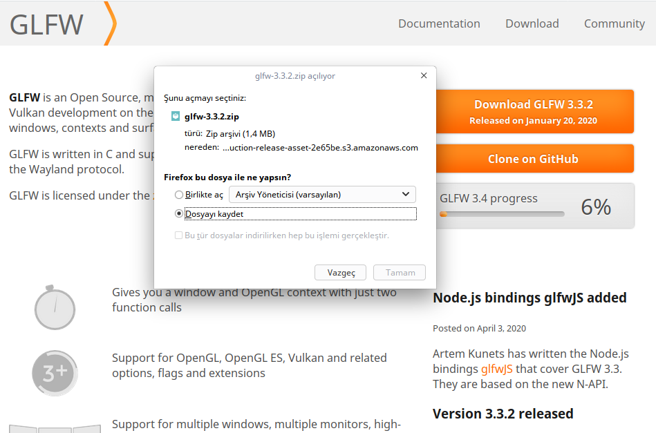

# VS Code GLFW Kütüphanesi Entegrasyonu

**GLFW** kütüphanesi sadece OpenGL kullandığımız zaman tek veya birden fazla işletim sistemi için çıktı almak istediğimizde kullandığınız sisteme özgü API 'lerle cebelleşmenizi önler.

## Eğitim İçeriği

Eğitimimizde VS Code 'a GLFW kütüphanesi yüklenecek ve entegrasyon sağlanacaktır. Eğitimin sonunda kavuşmak için sabırsızlandığımız **siyah ekran** ile karşılaşacağız. GLFW 'nun alternatifleri olarak bir çok kütüphane mevcuttur. SDL, SFML, GLUT hatta geliştirilmesi durdurulan freeGLUT gibi kütüphanelere nazaran GLFW seçilmesinin sebebi yalın ve sadece OpenGL, Vulkan programlamaya yönelik olmasıdır.

---

## GLFW Kütüphanesini İndirme ve Kurulum

İlk olarak `www.glfw.org` adresine girerek kütüphaneyi indiriyoruz.



İndirdiğimiz dosyası ilgili klasöre çıkartıp, açıyoruz. Gördüğünüz gibi yine **Cmake** ile oluşturulmuş bir dosya yapısı mevcut. Bizim yapmamız gereken **`build`** klasörü açıp, önce inşa dosyalarını **cmake ..** komutuyla oluşturduğumuz klasöre çıkarmaktır.


Muhtemelen `Makefile` 'ınız oluşmuştur. Devamında `make` komutuyla inşa dosyalarını derliyoruz. Burada `sudo` ve `install` kullanmamızın nedeni; kütüphanemizi sisteme de yüklemek istediğimiz içindir.

```bash
sudo make install
```

Eğer `Makefile` oluşmadıysa ve hata alıyorsanız **GLFW** 'nin kullandığı bazı developer (geliştirici) ortamları var ve bunları kurmamız gerekiyor.

Muhtemelen, doxygen ile ilgili hata alabilirsiniz.
```bash
sudo apt install doxygen
```

Kişisel sistemim için ekran kartı driverı olarak Bumblebee kurmuştum. Bunun asıl nedeni nvdia-xconfig kurulumunda yaşadığım siyah konsol ekranı hatasıydı.(Bu konu başlığıyla karıştırmayın. Bu hata ekran kartımın yazılımından kaynaklı aldığım ve bilgisayarım açıldığında siyah konsol ekranının göründüğü bir hataydı. - [Pardus Forumdaki Çözümü](https://forum.pardus.org.tr/t/nvidia-cift-ekran-karti-surucu-yukleme-nvidia-intel/14493/3?u=w3.eydi)) Bu nedenle sizde Bumblebee kurduysanız, X11 pencere sistemi ile ilgili sıkıntılar yaşayabilirsiniz. GLFW buna ihtiyaç duyduğu için developer paketlerinin başlık dosyalarını kuracağız. Aynı şey olmasa da X11 'nin başlık dosyalarına ihtiyaç olduğu için bu hatayı vermiş olabilir.
```bash
sudo apt install libx11-dev
```

Hala hatalarla karşılaşıyorsanız ki ben karşılaştım. Aslında bundan sonraki hata `libxrandr-dev` ile alakalı olsada alttaki paketleri kurarak tüm sorunu çözebiliriz.
```bash
sudo apt install xorg-dev libglu1-mesa-dev
```

Hala hata alıyorsanız; tüm paketlerin kurulumu yapabilirsiniz.
```bash
libx11-dev libgl1-mesa-dev libglu1-mesa-dev libasound2-dev libgtk2.0-dev xorg-dev
```

GLFW bağımlılıkları hakkında daha detaylı bilgi için [Dependencies for Linux and X11](https://www.glfw.org/docs/latest/compile_guide.html#compile_deps_x11) konusuna bakabilirsiniz.

Sonunda kurulumumuzu gerçekleştirdik ve kütüphanemizi sistemimize yükledik.


Şimdi, CMakeLists.txt dosyamıza GLFW kütüphanemizi tanıtmaya geldi.

```cmake

...

set(PROJECT_HEADERS
        ${PROJECT_INCLUDE_DIR}/kutuphane.hpp)

find_package(glfw3 3.3 REQUIRED)

include_directories(${PROJECT_INCLUDE_DIR})

add_executable(${PROJECT_NAME} ${PROJECT_SOURCES})

target_link_libraries(${PROJECT_NAME} glfw)

```
## GLFW Kütüphanesini Kullanarak Siyah Ekran Oluşturma

Şimdi `main.cpp` dosyası içeriğini değiştiriyoruz.

```c

#include <iostream>

#include <GLFW/glfw3.h> // GLFW Kutuphane dosyamızı dahil ettik.

#include "kutuphane.hpp"

int main(int argc, char** argv){

    if(!glfwInit())  // glfw yüklenmesi sağlanıyor. Yüklenmezse programın çalışmasına
        return -1;   // gerek kalmayacak.

    // Pencere oluşturuluyor.
    GLFWwindow* window = glfwCreateWindow(800,600,"İlk GLFW Penceresi",NULL,NULL);

    if(window == NULL){
        std::cout << "Pencere oluşturulamadı!" << std::endl;

        glfwTerminate(); // Kaynakları serbest bırak.

        return -1; // main 'i durdur.
    }

    glfwMakeContextCurrent(window); // OpenGL 'i kullanacağımız pencereyi bağlıyoruz.

    while(!glfwWindowShouldClose(window))
    {
        glfwSwapBuffers(window); // OpenGL çizimlerini pencereye aktarmayı sağlıyor.

        glfwPollEvents(); // Klavye veya fare tıklanması gibi olayları aktarıyor.
    }
    
}

```

Devamında <kbd>Ctrl</kbd> + <kbd>Shift</kbd> + <kbd>B</kbd> ile bir seferlik `Build` işlemi yapmamız gerekiyor. En son <kbd>F5</kbd> ile **`Start Debugging`** yaparak programımızı çalıştırıyoruz.


---

**MIT Lisansı**

[Telif Hakkı](https://github.com/w3eydi/OpenGL-VSCode/blob/master/LICENSE) (Copyright) (c) 2020 Eydi Gözeneli - github.com/w3eydi
