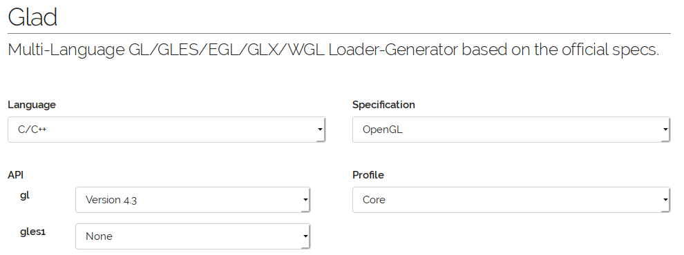
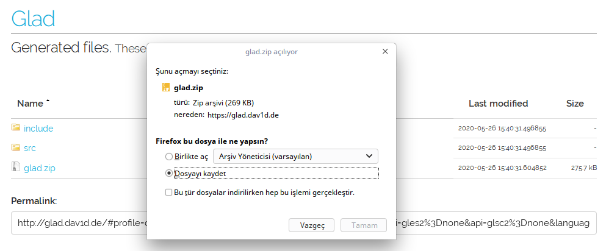
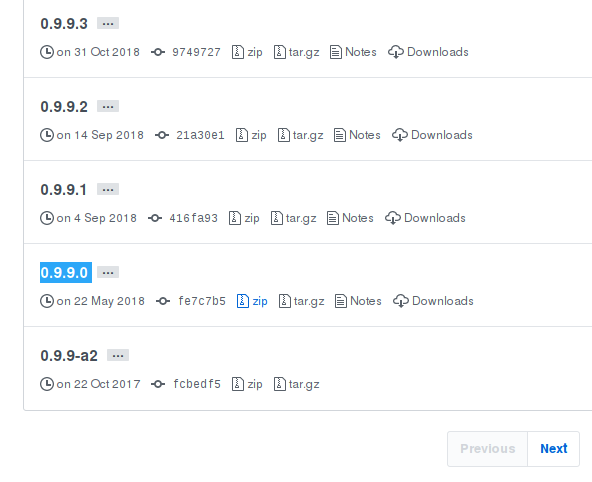

# Glad ve Glm Kütüphaneleri Entegrasyonu

**Glad**, OpenGL ile çalışan programların arka planda OpenGL 'in dinamik kütüphaneleriyle bağlantı kurmalarını sağlamaktadır. İlgili OpenGL kütüphaneleri bilgisayarınıza driver yüklemesi sırasında gelmektedir. Linux için **libGL.so** iken, Windows'ta **OpenGL.dll** 'dir. Kısacası; OpenGL ile bağlantı kurmayı Glad ile yapacağız. Biz Glad 'ın fonksiyonlarına komut gönderince, oda ilgili OpenGL fonksiyonlarına ulaşacaktır.

**Glm** ise OpenGL 'de matrislerle vektörel olarak hesap yapmamız için bize hazır üretilmiş fonksiyonlar sunar. Bu fonksiyonları kendimizde oluşturup, yapabiliriz. Ama muhtemelen bu kütüphane kadar kararlı olmaz.

## Eğitim İçeriği

Eğitimimizde kaldığımız yerden devam edip, Glad ve Glm kütüphanelerinin entegrasyonu sağlanacaktır.

---

## Glad Kütüphanesini İndirme ve Kurulum

İlk olarak `https://glad.dav1d.de/` adresine giriyoruz ve kütüphaneyi indirmek için bazı ayarları seçmemiz gerekiyor.



OpenGL 3.3 ve üzeri istediğiniz versiyonu seçebilirsiniz. **Profile --> Core** seçeneğini de belirttikten sonra en alttaki **`Generate`** düğmesine basalım. Bizi başka bir sayfaya yönlendirecek ve oradaki **.zip** uzantılı dosyayı indiriyoruz.



Dikkat etmemiz gereken husus `include` klasörü içine gladdaki `include` içerisindeki klasörleri eklemeliyiz. Aynı şekilde `src` içerisine de `glad.c` dosyasını ekliyoruz. `CMakeLists.txt` dosyasını aşağıdaki şekilde düzenliyoruz.

```cmake

...

set(PROJECT_SOURCES
        ${PROJECT_SOURCE_DIR}/main.cpp
        ${PROJECT_SOURCE_DIR}/kutuphane.cpp
        ${PROJECT_SOURCE_DIR}/glad.c)

set(PROJECT_HEADERS

...

```

Ayrıca; `main.cpp` dosyamızı da düzenlememiz gerekmektedir. Glad kütüphanesini eklerken, **`<glad/glad.h>`** şeklinde ekliyoruz. En önemli husus ise Glad kütüphanesini GLFW kütüphanesinin **üstünde** dahil edilmesidir.

```c

#include <iostream>

#include <glad/glad.h> // Glad GLFW 'in üstünde dahil edildi.

#include <GLFW/glfw3.h> // GLFW Kutuphane dosyamızı dahil ettik.

#include "kutuphane.hpp"

int main(int argc, char** argv){

...

```

## Glm Kütüphanesini İndirme ve Kurulum

Glm kütüphanesi için `https://glm.g-truc.net/0.9.9/` adresine giriyoruz. Sol taraftaki `Download` sekmesine tıkladığımızda bizi github sayfasına yönlendiriyor. En güncel versiyonu indirelim.


İndirdiğimiz `.zip` uzantılı dosyası yine `Masaüstü` veya dilediğiniz bir klasöre çıkarabilirsiniz. İçerisine girip, `build` isimli bir klasör oluşturalım. `build` klasörü içerisinde `Terminal(Konsol)` açıp, öncelikle **`cmake ..`** komutuyla bir önceki klasördeki dosyaları `build` klasörüne derlenmesini sağlayalım. Şimdi ise `build` klasörü içerisindeyken;

```bash
sudo make install
```

komutuyla Glm kütüphanesinin sistemimize yüklenmesini sağlıyoruz.


>**NOT :** Benim bilgisayarımdaki gibi OpenGL destekliyor fakat CUDA tabanlı işlem kapasitesine sahip bir ekran kartınız yoksa `sudo make install` kısmında hata alabilirsiniz. Sanırım sorunununuzu [bu linkte](https://askubuntu.com/questions/1038704/make-no-rule-to-make-target-install-when-trying-to-install-xmr-stak) çözebilirsiniz yada kısayol istiyorsanız daha eski bir Glm kütüphanesi indirin. Ben [Glm-0.9.9.0](https://github.com/g-truc/glm/releases/tag/0.9.9.0) versiyonunu indirerek sağlıklı bir şekilde kurulumu gerçekleştirdim.



Şimdi sırada `CMakeLists.txt` dosyamızı düzenlemeye geldi. `find_package(glm REQUIRED)` şeklinde kütüphanemizi ekliyoruz.

```cmake

...

find_package(glfw3 3.3 REQUIRED)

find_package(glm REQUIRED)

include_directories(${PROJECT_INCLUDE_DIR})

...

```

Şimdi `main.cpp` dosyası içeriğini değiştiriyoruz.

```C++

#include <iostream>

#include <glad/glad.h> // Glad GLFW 'in üstünde dahil edildi.

#include <GLFW/glfw3.h> // GLFW Kutuphane dosyamızı dahil ettik.

#include <glm/mat4x4.hpp> // Kullanmak istediğimiz kütüphaneyi seçebiliriz.

#include "kutuphane.hpp"

int main(int argc, char** argv){

...

```


Bir sonraki bölümde örnek bir proje yaparak OpenGL eğitimimizi bitireceğiz.


---

**MIT Lisansı**

[Telif Hakkı](https://github.com/w3eydi/OpenGL-VSCode/blob/master/LICENSE) (Copyright) (c) 2020 Eydi Gözeneli - github.com/w3eydi
